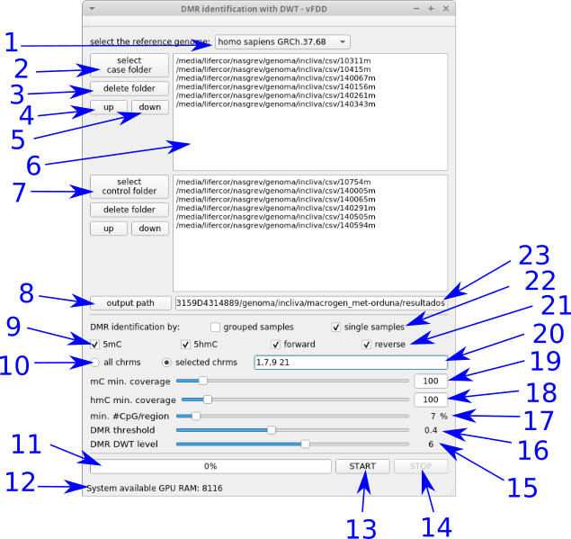

# HPG-Dhunter batch process
**HPG-Dhunter batch** identifier is an identifier tool without the GPU memory space limitation. It is also based on Discrete Wavelet Transform (DWT) analyzer as a Differentially Methylated Regions (DMRs) finder and it is a complementary tool of [**HPG-Dhunter**](https://github.com/grev-uv/hpg-dhunter) visualizer.

**HPG-Suite** began with [**HPG-Methyl**](https://github.com/grev-uv/hpg-methyl), an ultrafast and highly sensitive Next-Generation Sequencing read mapper and methylation context extractor, that works with single-end or paired-end .fastq files and provides .bam files. The following income tool was [**HPG-Hmapper**](https://github.com/grev-uv/hpg-hmapper), a parallel software tool for analyzing DNA hydroximethylation data, that works with the .bam files from HPG-Methyl and provides .csv files, mapping the number of Cs, noCs, 5mCs and 5hmCs reads per position, chromosome and sense (forward, reverse).

**HPG-Dhunter batch** identifier is a powerful tool that uses the high performance parallel computation of GPUs and CUDA application programming interface model for analyze the DNA methylation and save the results into a .gff and .csv file, minimizing the CPU-GPU communication. The batch process allows the identification of DMRs analyzing all the samples together. This improvement is possible thanks to eliminate the visualization part, doing GPU computation as many times as needed.

## Handling
**HPG-Dhunter batch** shows a user interface (UI) whose design has been developed according to the usability principles. HPG-Dhunter background has been developed from the research about the use of wavelet transform over the methylated files treated like a signal as you can read in this [paper](https://link.springer.com/article/10.1007%2Fs11227-018-2670-5).

The DMR detection process follows a pipeline that begins selecting the cases and control files. After that, the ratio between the methylated coverage and the total coverage over each chromosome position is calculated and upload to the global memory of the GPU device in batches. With all the the computed results, is possible to identify the DMRs of all selected samples.

This is the UI:



where:
1. Select the chromosome of reference.
2. Open directory browser to select the directory of each case sample.
3. Delete the selected file.
4. Climb one position the selected file.
5. Low one position the selected file
6. List of selected files to analyze
7. Open directory browser to select the directory of each control sample.
8. Open directory browser to select the directory where save the file with DMRs
9. Select the kind of signal to analyze (mC and/or hmC)
10. Select the number of chromosomes to analyze (all / list).
11. Progress bar.
12. Some system information
13. Button to start the process.
14. Button to stop the process.
15. Slider to select the wavelet transform level
16. Slider to select the threshold for DMR identification
17. Slider to select the minimum ratio of methylated positions by region
18. Slider and text window to select the minimum coverage of hmC signal
19. Slider and text window to select the minimum coverage of mC signal
20. Text window to write de list of chromosomes to analyze.
21. Select the direction to analyze (forward and/or reverse).
22. Select the kind of analyze (grouped or single samples)
23. Text window showing the path to save the results.

There is an important change to do before launch the compilation. The file [hpg_dhunter.pro](src/hpg_dhunter.pro#L58) needs the path to cuda sdk installation at line 58:
```
CUDA_DIR = /path/to/cuda/sdk/cuda
```

## System requirement
The HPG-Dhunter batch identifier, as a complementary tool of HPG-Dhunter visualizer, is the next step after HPG-HMapper detector and mapper of the methylated and hidroximethylated regions in the work-flow of HPG-suite. Then, the system requirement needs to be, at least, the same, adding a GPU device.
HPG-Dhunter should work properly in a station with the following set-up:
- A 64 bit Intel CPU compatible with SSE4.2.
- The DNA data for DMR tasks needs as adjacent memory as the number of samples by the length of the largest chromosome to be analized. This parameter has a direct relation with the global memory available of the GPU device. The test was done with 32 MB of RAM.
- The amount of samples that HPG-Dhunter can analize at the same time is directly dependent with the amount of the device memory. Working with a Nvidia GeForce GTX 1080 with 8 GB of GRAM, is possible to analyze and visualize up to six samples of chromosome-21 or up to four chromosome-10 or up to two chromosome-1 at the same time.
- The CUDA compilation is configured to a single device with Nvidia Pascal GPU architecture. So, the devices that will work properly are Titan XP and X models, Tesla P40, P6 and P4 models, Quadro P6000, P5000, P4000 models, GeForce GTX 1808Ti, 1080, 1070Ti, 1070 models, and others easy to find here.
- The Nvidia driver is needed (v384 or higher).
- The CUDA API is needed(v9 or higher).

## Build
The way to build HPG-Dhunter batch identifier in your system is opening the software as a project inside an installed QtCreator (> v4.5, Qt > v5.8, GCC 5) IDE and build it from there.
In the next future, another available way will be to handling this software as a cloud service.

## Issues
HPG-Dhunter - Copyright (C) 2018 - grev-uv
This program comes with ABSOLUTELY NO WARRANTY.
This is free software, and you are welcome to redistribute it under certain conditions; visit https://www.gnu.org/copyleft/gpl.html for details.
However, if you find any bugs, issues, want a specific feature added or need help, feel free to add an issue or extend an existing one. Pull requests are welcome.


## License
HPG-Dhunter batch identifier is free software and licensed under the GNU General Public License version 3.
HPG-Dhunter batch identifier was developed under Qt as a platform application development framework for linux/ubuntu desktop, using a free software LGPL v3 license.

## Contact
Contact any of the following developers for any enquiry:
- Juanma Orduña (juan.orduna@uv.es). 
- Mariano Pérez (mariano.perez@uv.es). 
- Lisardo Fernández (lisardo.fernandez@uv.es). 
